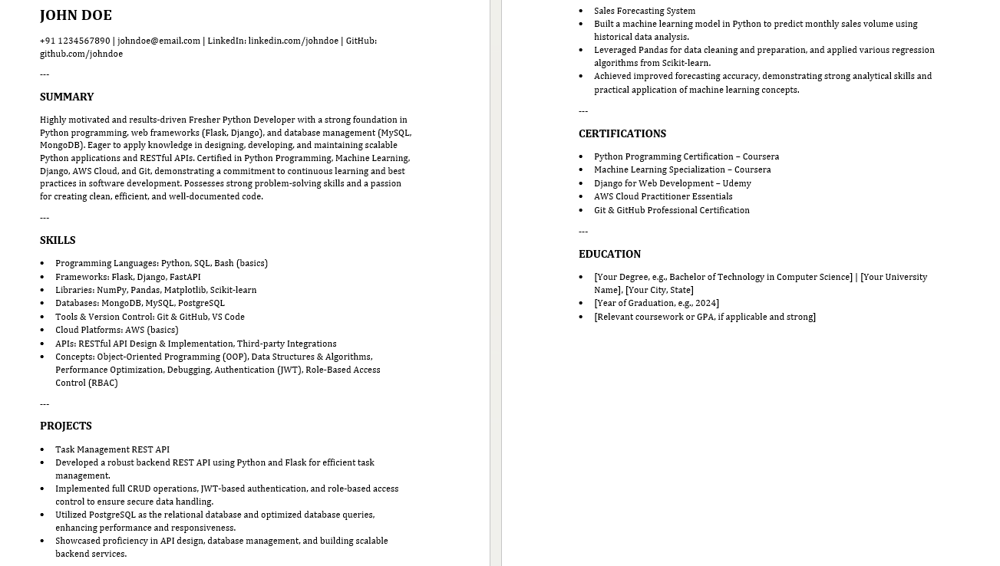
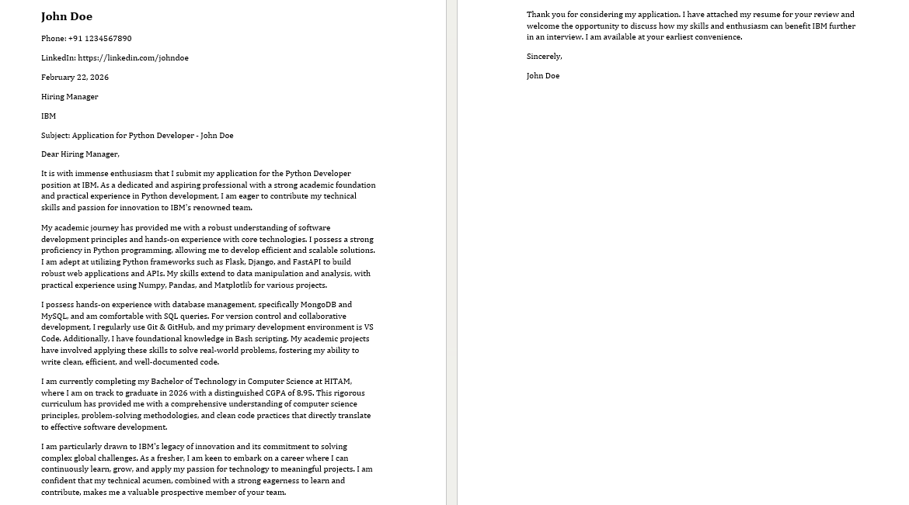
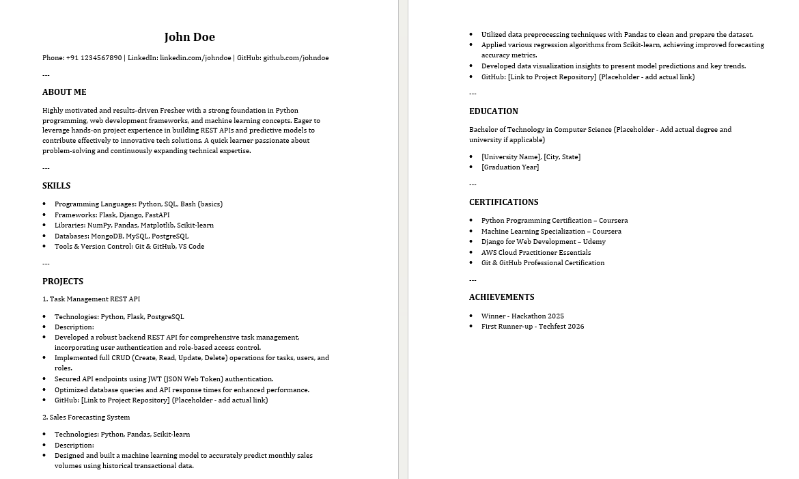

# AI_Document_Builder ✨
### AI-Powered Resume, Cover Letter & Portfolio Generator

A Streamlit-based web application that generates professional **Resumes, Cover Letters, and Portfolio summaries** using AI.  
The system produces downloadable **DOCX and PDF files** and automatically switches to an ATS-friendly structured version if the AI quota is exceeded.

---

## 🚀 Live Application

https://aidocumentbuilder-hma55jhbcy5ubcymopqcyq.streamlit.app/

---

## 📌 Project Overview

This application allows users to:

- Generate professional **Resumes**
- Generate tailored **Cover Letters**
- Generate structured **Portfolio summaries**
- Choose between **Classic, Modern, and Professional templates**
- Select profile type: **Fresher or Experienced Professional**
- Download documents in **DOCX and PDF formats**
- Automatically generate an ATS version if AI quota is exceeded

The goal is to simplify professional document creation while maintaining structure, clarity, and job-readiness.

---

## ✨ Key Features

- AI-powered content generation (Google Gemini)
- Multiple template styles
- Fresher & experienced profile modes
- ATS-friendly fallback generation
- Clean and responsive Streamlit interface
- Downloadable DOCX & PDF outputs
- Modular and maintainable project structure

---

## 🛠️ Tech Stack

- Python  
- Streamlit  
- Google Gemini API  
- python-docx  
- ReportLab  

---

## 📂 Project Structure

```
AI_Document_Builder/
│
├── app.py
├── requirements.txt
├── style.py
│
├── generators/
│   ├── resume_generator.py
│   ├── coverletter_generator.py
│   └── portfolio_generator.py
│
├── assets/
│   ├── coverletter_professional.png
│   ├── portfolio_modern.png
│   ├── resume_classic_fresher.png
│   └── resume_modern_prfoessional.png
```
---

## 📸 Sample Outputs

### Resume (Classic – Fresher)


### Resume (Modern – Professional)


### Cover Letter (Professional Template)


### Portfolio (Modern Template)


---

## ⚙️ Installation (Local Setup)

### 1️⃣ Clone the Repository

git clone https://github.com/YOUR_USERNAME/YOUR_REPO.git  
cd YOUR_REPO  

### 2️⃣ Create a Virtual Environment

Windows  
python -m venv venv  
venv\Scripts\activate  

Mac/Linux  
python3 -m venv venv  
source venv/bin/activate  

### 3️⃣ Install Dependencies

pip install -r requirements.txt  

Your `requirements.txt` should contain:

streamlit  
google-generativeai  
python-docx  
reportlab  

---

## 🔑 API Configuration

### For Local Development

Create a folder named:

.streamlit/

Inside it create:

secrets.toml

Add:

GOOGLE_API_KEY = "your_api_key_here"

### For Streamlit Cloud Deployment

Go to:

App Settings → Secrets  

Add:

GOOGLE_API_KEY = "your_api_key_here"

---

## ▶️ Running the Application

streamlit run app.py

Open the local URL shown in your terminal.

---

## 🧠 How It Works

1. User selects document type.  
2. Inputs personal details, skills, and target role.  
3. AI generates structured professional content.  
4. The system creates a formatted DOCX file and converts it into a PDF version.  
5. Files become available for download.  

If AI quota is exceeded, the system automatically generates a structured ATS template version.

---

## 🎯 Use Cases

- Students applying for internships  
- Fresh graduates  
- Experienced professionals  
- Quick professional document generation  
- AI-assisted resume customization  

---

## 🔒 Security

- API keys are not hardcoded.  
- Secrets are stored securely using Streamlit Secrets.  
- Virtual environment folders are excluded from the repository.  

---

## 📈 Future Improvements

- Additional template themes  
- Resume scoring system  
- Keyword optimization from job descriptions  
- Multi-page portfolio layouts  
- LinkedIn export format  

---

## 👤 Author

Your Name  
https://github.com/J-sravani19 

---

## 📄 License

This project is for educational and demonstration purposes.
